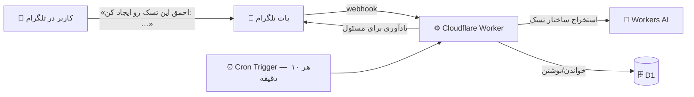

<div dir="rtl">

# 🤖 ahmagh_agent

**مدیرِ تسک و ورک‌فلو با هوش مصنوعی، برای تلگرام** — باتی که با زبان طبیعی فارسی تسک می‌سازه، وضعیتش رو دنبال می‌کنه و تا وقتی انجام نشه، با یک الگوریتمِ یادآوریِ پله‌ای اذیتت می‌کنه 😈

[](https://developers.cloudflare.com/workers/)
[](https://developers.cloudflare.com/d1/)
[](https://developers.cloudflare.com/workers-ai/)
[](https://core.telegram.org/bots/api)

ساخته‌شده دقیقاً طبق فرمت استاندارد و پیشنهادی خود **Cloudflare** برای پروژه‌های جدید Workers (فایل `wrangler.jsonc`، پوشه‌ی `migrations/` برای D1، سیکرت‌ها با `wrangler secret put`، دیپلوی با `wrangler deploy`):

| قطعه | سرویس Cloudflare |
|---|---|
| اجرای بات (وبهوک تلگرام) | **Workers** |
| دیتابیس تسک‌ها و کاربرها | **D1** (SQLite) |
| استخراج تسک از زبان طبیعی فارسی | **Workers AI** (`llama-3.3-70b-instruct-fp8-fast`) |
| موتور یادآوری | **Cron Triggers** (هر ۱۰ دقیقه) |

---

## 🎬 فاز ۱ — «احمق این تسک رو ایجاد کن»

کافیه توی تلگرام به بات بگی:

> **احمق این تسک رو ایجاد کن: تماس با مشتری، تا فردا**

بات متن رو به Workers AI می‌ده، مدل ساختار تسک رو درمیاره (عنوان، توضیحات، مسئول، تاریخ‌ها) و کارت تسک رو با دکمه‌های تغییر وضعیت برمی‌گردونه. اگر AI در دسترس نباشد، یک مسیر جایگزین (heuristic) ساده هم داخل کد هست تا بات هیچ‌وقت زمین نخورد.

### فیلدهای یک تسک

| فیلد | ستون در D1 | توضیح |
|---|---|---|
| عنوان تسک | `title` | از متن کاربر استخراج می‌شود |
| توضیحات تسک | `description` | جزئیات باقی‌مانده‌ی متن |
| ایجادکننده | `creator_id` | کسی که تسک را ساخته |
| مسئول | `assignee_id` | کسی که باید انجامش بدهد (یادآوری‌ها به او می‌رسد) |
| وضعیت | `status` | `not_started` ⬜️ / `in_progress` 🔄 / `done` ✅ |
| تاریخ شروع | `start_date` (+ `started_at` واقعی) | YYYY-MM-DD؛ اگر نگویی خالی است |
| تاریخ ساخت | `created_at` | خودکار |
| تاریخ پایان | `due_date` (+ `completed_at` واقعی) | سررسید؛ «تا فردا»، «تا شنبه»، «تا ۱۵ مرداد» و… را می‌فهمد |
| یادآوری | `last_reminded_at` + `reminder_count` | موتور یادآوری را راه می‌اندازد |

### معماری



---

## 🔔 الگوریتم یادآوری

کرون‌جاب هر ۱۰ دقیقه اجرا می‌شود و برای هر تسکِ باز، بسته به وضعیتش تصمیم می‌گیرد که **الان وقت پیام دادن است یا نه** — پیام همیشه به **مسئولِ تسک** می‌رود:

| حالت تسک | بازه‌ی یادآوری |
|---|---|
| ✅ تمام‌شده | هیچ‌وقت |
| 📅 تاریخ شروعش هنوز نرسیده | هیچ‌وقت (قبل از روزِ شروع اذیت نمی‌کند) |
| بدون تاریخ پایان | هر ۴۸ ساعت |
| بیش از ۳ روز تا سررسید | هر ۲۴ ساعت |
| ۱ تا ۳ روز تا سررسید | هر ۱۲ ساعت |
| کمتر از ۲۴ ساعت تا سررسید | هر ۴ ساعت |
| 🔴 سررسید گذشته | هر ۲ ساعت — و لحن پیام‌ها پله‌پله تند می‌شود 😤→🚨 |

اگر مسئول هرگز با بات حرف نزده باشد (چت خصوصی نداشته باشیم)، یادآوری به ایجادکننده می‌رسد.

---

## 📁 ساختار پروژه (فرمت Cloudflare Workers)

```
ahmagh_agent/
├── wrangler.jsonc               ← پیکربندی (فرمت پیشنهادی جدید Cloudflare)
├── migrations/
│   └── 0001_init.sql            ← اسکیمای D1 (فرمت رسمی مایگریشن)
├── src/
│   ├── index.ts                 ← نقطه‌ی ورود: fetch (وبهوک) + scheduled (کرون)
│   ├── handlers.ts              ← منطق پیام‌ها، دستورها و دکمه‌ها
│   ├── ai.ts                    ← استخراج تسک با Workers AI + فالبک هیوریستیک
│   ├── db.ts                    ← کوئری‌های D1
│   ├── reminders.ts             ← الگوریتم یادآوری
│   ├── telegram.ts              ← کلاینت سبک Bot API
│   ├── format.ts                ← کارت تسک، وضعیت‌ها، کیبورد
│   ├── dates.ts                 ← تقویم جلالی، ارقام فارسی، وقت تهران
│   └── *.test.ts                ← تست‌ها (vitest)
├── .dev.vars.example            ← نمونه‌ی سیکرت‌های لوکال
├── .github/workflows/deploy.yml ← دیپلوی خودکار (wrangler-action — قالب رسمی CI)
├── package.json
└── tsconfig.json
```

---

## 🚀 راه‌اندازی (۵ دقیقه)

### ۱) ساخت بات تلگرام

به [@BotFather](https://t.me/BotFather) بروید، `/newbot` بزنید، اسم بدهید و **توکن** را نگه دارید.

### ۲) کلون و نصب

```bash
git clone https://github.com/mohammadiuser111-web/ahmagh_agent.git
cd ahmagh_agent
npm install
```

### ۳) دیتابیس D1

این ریپو از قبل روی دیتابیسِ موجود `iman` تنظیم شده (نام و شناسه‌ی واقعی داخل `wrangler.jsonc` هست). اگر دیتابیس دیگری می‌خواهید:

```bash
npx wrangler login
npx wrangler d1 create ahmagh_agent
```

و بعد `database_name` و `database_id` را در `wrangler.jsonc` (به‌همراه دستورهای migrate در `package.json` و `deploy.yml`) به‌روز کنید.

### ۴) مایگریشن

```bash
npx wrangler d1 migrations apply iman --remote
```

### ۵) سیکرت‌ها (هرگز commit نمی‌شوند)

```bash
npx wrangler secret put TELEGRAM_BOT_TOKEN    # توکنی که BotFather داد
npx wrangler secret put WEBHOOK_SECRET        # یک رشته‌ی تصادفی طولانی (مثلاً: openssl rand -hex 32)
```

### ۶) دیپلوی

```bash
npx wrangler deploy
```

### ۷) اتصال وبهوک تلگرام

آدرس زیر را یک بار در مرورگر باز کنید (عوض کردن `<account>` و `WEBHOOK_SECRET`):

```
https://ahmagh-agent.<account>.workers.dev/set-webhook?key=<WEBHOOK_SECRET>
```

همین! حالا در تلگرام `/start` بزنید و اولین تسک را بسازید:

> احمق این تسک رو ایجاد کن: تست اول، تا فردا

---

## 🤖 دستورات

| دستور / گفتار | کار |
|---|---|
| «احمق این تسک رو ایجاد کن: …» | 🎬 ساخت تسک با زبان طبیعی (فاز ۱) |
| `/new <متن>` | مثل بالا، بدون نیاز به کلمه‌ی «احمق» |
| `/tasks` | تسک‌های بازِ من |
| `/tasks done` / `/tasks created` / `/tasks all` | فیلترهای لیست |
| `/task <شناسه>` | جزئیات + دکمه‌های تغییر وضعیت |
| `/status <شناسه> <وضعیت>` | تغییر وضعیت (فارسی هم قبول است: `تمام`، `در_حال_انجام`، `شروع_نشده`) |
| `/done <شناسه>` | علامت‌گذاری به‌عنوان تمام‌شده |
| `/assign <شناسه> @یوزرنیم` | واگذاری به کس دیگر (باید یک بار با بات حرف زده باشد) |
| `/delete <شناسه>` | حذف تسک |
| `/help` | راهنما |

> 💡 تاریخ‌ها را طبیعی بگویید: «تا فردا»، «تا آخر هفته»، «از شنبه»، «تا ۱۵ مرداد» — به میلادی ISO تبدیل و ذخیره می‌شود و همه‌جا به شمسی نمایش داده می‌شود.

---

## 🛠 توسعه‌ی محلی

```bash
cp .dev.vars.example .dev.vars      # مقادیر واقعی را بگذارید
npm run db:migrate:local            # مایگریشن روی D1 لوکال
npm run dev                         # wrangler dev --test-scheduled
```

- تست دستی کرون یادآوری: `curl "http://localhost:8787/__scheduled?cron=*/10+*+*+*+*"`
- برای وبهوک لوکال: `cloudflared tunnel --url http://localhost:8787` و بعد `setWebhook` روی آدرس تانل.
- تست‌ها و تایپ‌چک: `npm test` و `npm run typecheck`

## ⚙️ CI/CD

`.github/workflows/deploy.yml` بعد از هر پوش به `main`، اول مایگریشن D1 را اعمال و بعد ورکر را دیپلوی می‌کند (قالب رسمی [wrangler-action](https://developers.cloudflare.com/workers/ci-cd/github-actions/)). فقط باید سیکرت `CLOUDFLARE_API_TOKEN` را در تنظیمات ریپو بسازید. اگر CI نمی‌خواهید فایلش را حذف کنید.

## 🔒 امنیت

- توکن بات و رمز وبهوک **فقط** به‌صورت Secret (نه در کد، نه در `wrangler.jsonc`).
- همه‌ی درخواست‌های `/webhook` با هدر `X-Telegram-Bot-Api-Secret-Token` تلگرام تأیید می‌شوند.
- تغییر وضعیت/حذف فقط توسط **مسئول یا سازنده‌ی تسک** ممکن است.

## 🗺 نقشه راه

- [ ] **فاز ۲:** تسک‌های تکرارشونده (روزانه/هفتگی)، اولویت و تگ، گزارش هفتگی خودکار
- [ ] **فاز ۳:** ورک‌فلوها (زنجیره‌ی تسک‌های وابسته)، پشتیبانی کامل گروه‌ها، داشبورد وب
- [ ] **فاز ۴:** یکپارچگی با تقویم، خروجی Excel/PDF، خلاصه‌سازی هفتگی با AI

## 📄 لایسنس

[MIT](./LICENSE)

</div>
